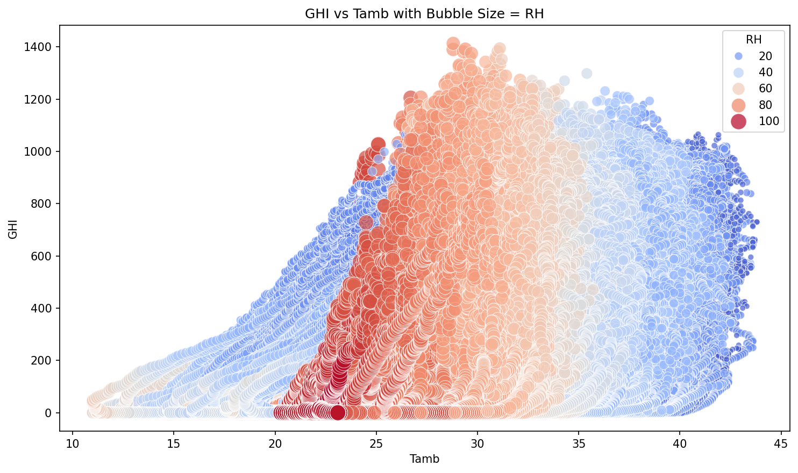
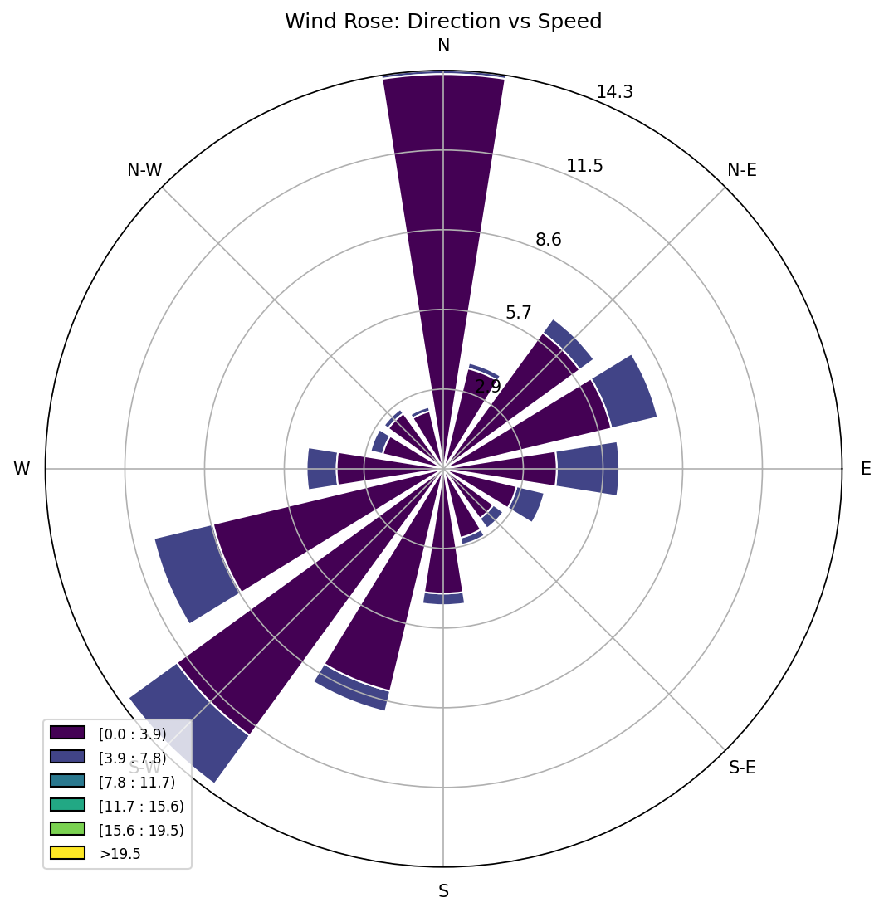

```markdown
#  MoonLight Energy Solutions – data analysis

This repository contains an exploratory data analysis (EDA) pipeline for environmental sensor data collected from **Benin**, **Sierra Leone**, and **Togo**.

---

##  Project Objective

As an analytics engineer at **MoonLight Energy Solutions**, the goal is to:
- Clean and explore environmental sensor data
- Detect anomalies, trends, and correlations
- Compare solar performance across the three countries
- Recommend optimal regions for solar installation based on insights

---

##  Project Structure

```

MoonLight-Energy-Solutions-Data-Analysis/
├── notebooks/
   ├── benin.ipynb
   ├── sierraleone.ipynb
   └── togo.ipynb
|── scripts/
├── data/
├── cleaned\_data/
├── test\_data/
   ├── benin-malanville.csv
   ├── sierraleone-bumbuna.csv
   └── togo-dapaong\_qc.csv
|── graphs/
   ├── benin/
   ├── sierraleone/
   └── togo/
├── requirements.txt
├── .gitignore
├── setup.sh
└── README.md

````

---

## 🔍 Analysis Highlights

Each country's EDA notebook includes:
- Summary statistics & missing value report
- Outlier detection and cleaning (Z-score method)
- Time-series plots (daily & hourly GHI, Tamb)
- Boxplots, histograms, and heatmaps
- Wind rose plots and scatter plots
- Bubble charts (GHI vs Tamb with RH as size)
- Impact analysis of manual cleaning on panel performance

>  Raw datasets are excluded from the repo via `.gitignore`. `test_data/` contains mock CSVs for public testing and CI/CD.

---

##  Version Control with Git

This project was version-controlled using **Git** throughout the process:
- All milestones were committed progressively (setup, cleaning, EDA, documentation)
- GitHub was used for remote version control and collaboration
- CI/CD integration via GitHub Actions automatically validates notebooks

 View full commit history:  
[GitHub commit log](https://github.com/NuryeNigusMekonen/MoonLight-Energy-Solutions-Data-Analysis/commits/main)

---

##  Environment Setup Instructions

You can use the included `setup.sh` or follow these steps manually:

### 1. Clone the repository

```bash
git clone https://github.com/NuryeNigusMekonen/MoonLight-Energy-Solutions-Data-Analysis.git
cd MoonLight-Energy-Solutions-Data-Analysis
````

### 2. Create and activate a virtual environment

```bash
python -m venv week_0_venv
source week_0_venv/bin/activate  # Windows: .\week_0_venv\Scripts\activate
```

### 3. Install dependencies

```bash
pip install -r requirements.txt
```

### 4. Run notebooks

Use Jupyter or VSCode to open and run the notebooks in the `notebooks/` directory.

---

##  Optional: Quick Setup via Bash Script

You can also use the automated setup script:

```bash
bash setup.sh
```

---

##  Key Insights

* **Benin**: Strong midday irradiance, moderate wind variability. Cleaning slightly improved ModA/ModB performance.
* **Sierra Leone**: Higher humidity and cloud cover reduced direct irradiance (DNI).
* **Togo**: Most balanced solar conditions and fewer anomalies — strong candidate for stable output.

---

##  Tools Used

* Python, Pandas, NumPy
* Seaborn, Matplotlib, Plotly
* Jupyter Notebooks
* Git, GitHub, GitHub Actions (CI/CD)
* Windrose library

---

##  Files Not Included

* Raw `.csv` files in `data/` and `cleaned_data/` are excluded via `.gitignore`
* Use mock files from `test_data/` or add your own local data to run full EDA

---

##  Sample EDA Results

### 🔵 GHI vs Ambient Temperature (Bubble Size = RH)

This bubble chart shows GHI generally increases with temperature, with larger RH values associated with reduced irradiance.



---

###  Wind Rose Plot (Benin)

Visualizes wind direction and speed distributions in Malanville.



---
##  Continuous Integration & Test Data Handling

The notebooks automatically switch to `test_data/` if `CI=true` is detected in the environment (used in GitHub Actions).  
Data loading is modularized with error handling via a `load_data()` function, which improves reproducibility and CI compatibility.

---
## 👤 Author & Credits

**Nurye Nigus Mekonen**
Electrical & Software Engineer
📧 [nurye.nigus.me@gmail.com](mailto:nurye.nigus.me@gmail.com)
🔗 [LinkedIn](https://www.linkedin.com/in/nryngs/)
🐙 [GitHub](https://github.com/NuryeNigusMekonen)
📞 +251 929 404 324

---
